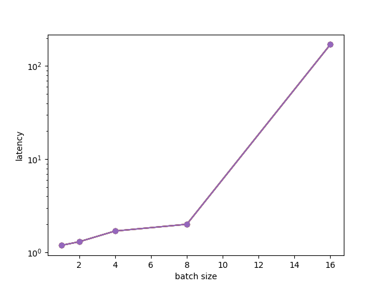
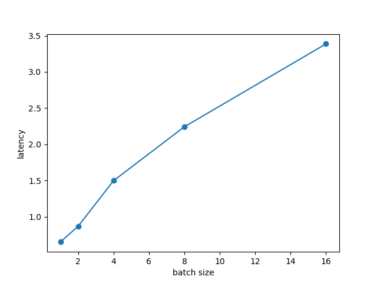
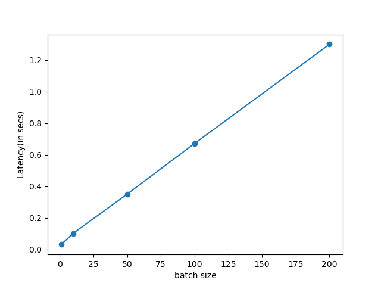
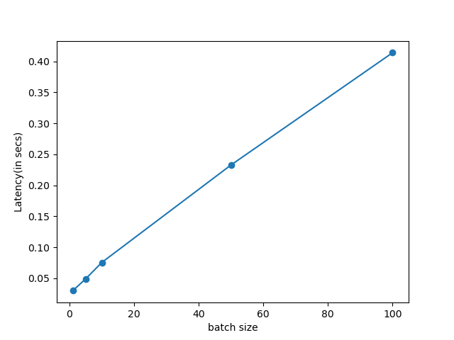

Lab 2: Benchmarking
===
The goal of this lab is for you to benchmark and compare model inference efficiency on your devices. **You should benchmark 2*N* models or model variants, where *N* is the size of your group (so, two models per person.)** For now, if you don't have appropriate evaluation data in place that's fine; you can provide pretend data to the model for now and just evaluate efficiency.

Ideally, the models you benchmark will be related to and useful for your class project, but at the very least the efficiency metrics should be useful.

Include any code you write to perform this benchmarking in your Canvas submission (either as a link to a folder on github, in a shared drive, zip, etc).

Group name:
---
Group members present in lab today: Saloni Mittal, Thomas Xu, Dhruv Naik

1: Models
----
1. Which models and/or model variants will your group be benchmarking? Please be specific.

We benchmarked a couple of pre-trained vision-language models and vision-language-navigation models. They are as follows:

- We first benchmark two pre-trained checkpoints from ["Episodic Transformers" repo](https://github.com/alexpashevich/E.T./tree/master) for vision-and-language navigation that reproduces results on [ALFRED](https://arxiv.org/abs/1912.01734) benchmark. We tested two variants of it:
    1. E.T trained on human data only
    2. E.T trained on human and synthetic data
2. Why did you choose these models?
    - The first two models are variants of an approach proposed by Pashevich, Alexander et al. in thier [paper](https://arxiv.org/abs/2105.06453) very recently. Episodic Transformer (E.T.) is a novel multimodal transformer that encodes language inputs and the full episode history of visual observations and actions. We chose this as this achieved the current SOTA on a very challenging ALFRED benchmark.
3. For each model, you will measure parameter count, inference latency, and energy use. For latency and energy, you will also be varying a parameter such as input size or batch size. What are your hypotheses for how the models will compare according to these metrics? Do you think latency will track with energy use, and parameter count? Explain.
    - For all transformer based models that we benchmark, the inference latency for one forward should scale quadratically in the input size as is the case with transformers and should scale linearly with the batch size.

2: Parameter count
----
1. Compute the number of parameters in each model. Remember, in Torch you should be able to start with something like this:
   ```
   num_params = sum([np.prod(p.size()) for p in model.parameters()])
   ```
   Report your results in a table.
   
   | Model | Parameter Count| Device |
   | ---   | ---            | --- |
   | LXMERT| 213930297      | Jetson |
   | VisualBert| 113856825 | Jetson |
   | Episodic Transformers (human+syn)| 21764052| Apple M1 |
   | Episodic Transformers (human only)| 21690324| Apple M1 |
   
2. Does this number account for any parameter sharing that might be part of the model you're benchmarking? 
3. Any difficulties you encountered here? Why or why not?
- There were mainly two blockers that prevented the E.T. models from running on jetson.
    1. The Alfred dataset that contains the trajectories (with expert actions, grounded language instructions and images) is huge and in a very complex format. Even when evaluating on a single trajectory, the code references a big mdb format file for metadata. Doing "ls -lh" from my terminal, shows the size of this file to be 1 TB which is very strange as the maximum storage size on my machine is 500 GB. Due to this, I'm unable to scp this file on the device.
    2. Other problem that remains unresolved is the x_display error. The E.T code requires to explicitly pass the x server id of the device as a command line argument. Somehow both passing this id and turning off x server are not resolving the error, "AssertionError: Invalid DISPLAY :0 - cannot find X server with xdpyinfo".


3: Latency
----
1. Compute the inference latency of each model. You should do this by timing the forward pass only. For example, using `timeit`:
    ```
    from timeit import default_timer as timer

    start = timer()
    # ...
    end = timer()
    print(end - start) # Time in seconds, e.g. 5.38091952400282
    ```
    Best practice is to not include the first pass in timing, since it may include data loading, caching, etc.* and to report the mean and standard deviation of *k* repetitions. For the purposes of this lab, *k*=10 is reasonable. (If standard deviation is high, you may want to run more repetitions. If it is low, you might be able to get away with fewer repetitions.)
    
    For more information on `timeit` and measuring elapsed time in Python, you may want to refer to [this Stack Overflow post](https://stackoverflow.com/questions/7370801/how-to-measure-elapsed-time-in-python).

    | Model | Average Latency for Batch size 1(in secs)|
   | ---   | ---            |
   | LXMERT|       |
   | VisualBert|  |
   | Episodic Transformers (human+syn)| 0.0324|
   | Episodic Transformers (human only)| 0.02994|
2. Repeat this, varying one of: batch size, input size, other. Plot the results (sorry this isn't a notebook):
   ```
   import matplotlib.pyplot as plt
   
   plot_fname = "plot.png"
   x = ... # e.g. batch sizes
   y = ... # mean timings
   
   plt.plot(x, y, 'o')
   plt.xlabel('e.g. batch size')
   plt.ylabel('efficiency metric')
   plt.savefig(plot_fname)
   # or plot.show() if you e.g. copy results to laptop
   ```
   
   LXMERT
   
   
   
   VisualBert
   
   

   Episodic Transformers (human+syn) on Apple M1

   

   Episodic Transformers (human only) on Apple M1

   
   
4. Any difficulties you encountered here? Why or why not?
    - The evaluation code in E.T. is designed to take only 1 trajectory (batch size 1) at inference as it is sequentially writing the next actions for an agent step. To do an ablation for different batch size, used a hack where I repeated the input tensors to the transformer along the batch size dimension.

4: Energy use
----
1. Compute the energy use of each model. You can use the `powertop` tool on RPi and Jetson (must be run as root):
    ```
    sudo apt install powertop
    ```
    and/or the `jtop` tool on Jetson (see installation instructions [here](https://github.com/rbonghi/jetson_stats/)). 
    
    Follow the same procedure as you used to compute latency, but this time compute energy: (avg) watts * time. You will likely need to sample power a number of times throughout each inference, and average.
    
    By default, `powertop` takes measurements every 20 seconds. You can change it with the `--time` parameter, which specifies number of seconds and allows for non-integer intervals (0.5 for half a second) e.g. to poll every second for 10 seconds and write to 10 csv files:
    ```
    sudo powertop --time=1 --csv=powertop.log --iteration=10
    ```
    Here is a link to the [`powertop` users guide](https://01.org/sites/default/files/page/powertop_users_guide_201412.pdf) [PDF].
2. Any difficulties you encountered here? Why or why not?

> Powertop is not giving any consumption output. 
> After installing powertop and running the example command on Jetson Nano 2GB, it was observed that the csv files did not have any values for power consumption.
> Further searching on the issue led to:
>  - https://forums.developer.nvidia.com/t/measure-power-consumption-on-jetson-tk1/37844
>  - https://askubuntu.com/questions/812563/what-are-ms-s-units-in-powertop-and-how-can-i-get-power-consumption-in-watts
>  - The powertop user guide also mentioned: The system  has  to  be  running on  battery  power  only.   Not  connected  to  the  wall  power.
>  - On commenting about this issue on Slack #jetson, discovered that Jetson Nano does not have the appropriate controller.
> - For models that were benchmarked on Apple M1, an energy consumption analysis was not possible as powertop requires Java runtime which is not present on the mac.

5: Discussion
----
1. Analyze the results. Do they support your hypotheses? Why or why not? Did you notice any strange or unexpected behavior? What might be the underlying reasons for that behavior?

5: Extra
----
A few options:
1. Compute FLOPs for each of your models. If you're using Transformer-based models, you might be able to use or modify the [`flops_counter.py`]() script in this directory. If you're using a CNN-based model, then you might be able to use or modify code in [this project](https://github.com/1adrianb/pytorch-estimate-flops) or similar. 
2. Evaluate on different hardware (for example, you might run the same benchmarking on your laptop.) Compare the results to benchmarking on your device(s).
3. Use real evaluation data and compare accuracy vs. efficiency. Describe your experimental setup in detail (e.g. did you control for input size? Batch size? Are you reporting average efficiency across all examples in the dev set?) Which model(s) appear to have the best trade-off? Do these results differ from benchmarking with synthetic data? Why or why not?

----
\* There are exceptions to this rule, where it may be important to include data loading in benchmarking, depending on the specific application and expected use cases. For the purposes of this lab, we want to isolate any data loading from the inference time due to model computation.
