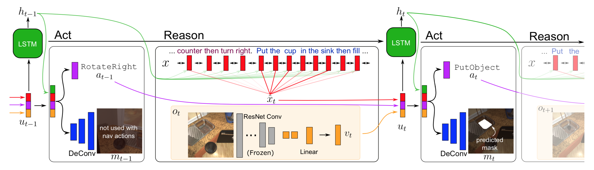

Lab 4: Baselines and Related Work
===
The goal of this lab is for you to survey work related to your project, decide on the most relevant baselines, and start to implement them.

Ideally, the outcome of this lab would be: (1) the related work section of your project report is written and (2) baselines have been benchmarked.

Group name: DST
---
Group members present in lab today: Thomas Xu, Druhv Naik, Saloni Mittal

1: Related Work
----
1. Choose at least 2 pieces of related work per group member. For each piece of related work, write a paragraph that includes:
    - Summary of the main contributions of that work.
    - How your proposed project builds upon or otherwise relates to that work.

**Room-Across-Room: Multilingual Vision-and-Language
Navigation with Dense Spatiotemporal Grounding**
> - Summary of main contributions:
>   - The authors introduce "Room-Across-Room" (RxR), which is a new Vision-and-Language Navigation (VLN) dataset. This new dataset expands upon previous datasets by addressing previous biases in paths and providing additional information for visible entities. It also supports three typologically diverse languages (English, Hindi, Telegu) to prevent overfitting to particular languages. They also provide baseline scores for monolingual, multilingual, and multitask VLN learning settings.
> - How we build upon or relate to the work:
>   - Our project examines how existing VLN models can be run on edge devices. Most of the existing research we have found makes use of datasets and simulators (e.g. R2R, Matterport) that are similar to the one in this work. 

**Are We There Yet? Learning to Localize in Embodied Instruction Following**
> - Summary of main contributions:
>   - The authors address the challenge of the agent localizing itself and target key locations in the simulated environment during VLN tasks. To do so, they add additional viewing angles to the agent's field of view (FOV), so that they may better train the agent to predict its localized location with relation to the target location each timestep. The authors also add their own object detection module to the pipelines of existing work to improve upon baseline performance.
> - How we built upon or relate to the work:
>   - Our project and this work both examine VLN performance for embodied agents in simulated environments. This work focuses more closely on one aspect of that, namely the challenges of learning the ability to localize, whereas we focus on reducing model size so that it may be run on the edge.

**Look Wide and Interpret Twice: Improving Performance on Interactive Instruction-following Tasks**
> - This paper presents a combination of several new ideas for interactive instruction following tasks and have showed the effectiveness of its approach on ALFRED. One key idea is using a two-stage interpretation of the provided instructions. First an instruction decoder interprets the language instructions without any visual inputs. It predicts a tentative sequece of action-object pairs where the "object" means the classes of objects. It then integrates the prediction with the visual information etc., yielding the final prediction of an action and an object. The authors hypothesise that since the obect’s class to interact is identified in the first stage, the model can accurately select the correct object from the input image in the second stage. They also show how by applying hierarchical attention from multiple surrounding views helps to obtain object-centric representation of visual inputs and improves performace on ALFRED.
> - The ALFRED paper present a baseline Seq2Seq model in which all the language directives are represented as a single sequence of word features, and soft attention is generated over it to specify the portion to deal with at each timestep. The authors argue this method does not use a few constraints on parsing the step-by-step instructions that they should be processed in the given order and when dealing with one of them, the other instructions, especially the future ones, will be of little importance. They claim that their proposed approach takes the above constraints into account.

**Agent with the Big Picture: Perceiving Surroundings for
Interactive Instruction Following**
> - This paper is one of the top models on the ALFRED leaderboard. The authors of this work claim that they do not use depth, segmentation masks, class masks, and panoramic images during test time. They do not use the alignments between step-by-step instructions and expert action sequences for training or testing (i.e., the instructions are serialized into a single sentence). Their model exploits the surrounding views by additional observations from navigable directions to enlarge the field of view of the agent.They design a model factorizing object localization and action policy in separate streams in a unified end-to-end framework.
> - Their method provides a framework that can be adopted in our future work on ALFRED. The two-stream factorization approach looks promising. They also propose improved components for object localization and obstacle avoidance that can be integrated with our work.

**Embodied BERT: A Transformer Model for Embodied, Language-guided Visual Task Completion**

>  Embodied Bert (EmBERT) proposes a transformer based language conditioned task completion model for high dimension, multimodal inputs across multiple time steps.
> It achieves a competitive score on the ALFRED Benchmark for interpreting grounded instructions for everyday tasks.
> The model uses OSCAR as backbone for multimodal representations. One of the main insights from the paper is the use of Object centric navigation, which they show improves the model success rate. 
> Since transformers have a quadratic time complexity with input length, EmBERT makes use segment level recurrent action decoder that is useful to model long trajectories and reuse the segment level state. 

> We use ALFRED dataset to benchmark our work in vision language navigation, thus this related work provides us with some key ideas such as use of object centric representations, and recurrent action decoder, to improve on the success rates and latency on device

**Vision-and-Language Navigation: Interpreting visually-grounded navigation instructions in real environments**

> Vision language navigation is an important field that enables embodied agents such as robots, autonomous vehicles to interact with and navigate their environment based on natural language instructions. It can be formulated as a visually grounded seq2seq task.
> 

2: Baselines
----
1. What are the baselines that you will be running for your approach? Please be specific: data, splits, models and model variants, any other relevant information.  

**[ALFRED Seq2Seq](https://github.com/askforalfred/alfred/tree/master/models)**
> - Data: ALFRED dataset (valid_seen, valid_unseen)
> - Splits: None
> - Model: Seq2Seq
> - Model Variants: None

(Diagram of model architecture, from original ALFRED paper)

2. These baselines should be able to run on your device within a reasonable amount of time. If you haven't yet tried to run them, please include a back-of-the-envelope calculation of why you think they will fit in memory. If the baselines will not fit in memory, return to (1) and adjust accordingly.  
> The model checkpoints fit on the device (Jetson Nano, 2 GB RAM):
> - best_seen.pth: 526 MB
> - best_unseen.pth 526 MB
> The validation data also fits on the device:
> - valid_seen: 1.3 GB
> - valid_unseen: 1.2 GB

3. How will you be evaluating your baselines?
> - We will compare total loss on the validation dataset for the two given checkpoints: best_seen.pth and best_unseen.pth. This loss is equal to the sum of these components:
>   - Action Loss (cross entropy)
>   - Mask Loss (weighted mask loss)
>   - Subgoal Completion Loss (MSE)
>   - Progress Monitoring Loss (MSE)
> - We will also compare the average latency for the forward pass of these, using a batch size of one (averaged over 10 passes)
4. Implement and run the baselines. Document any challenges you run into here, and how you solve them or plan to solve them.
> Challenges faced:
> - Ran into issues using the given code from the repo without interfacing with the simulator in an online/dynamic way. To solve this, we contacted the original authors via GitHub and they gave us recommendations for running without the simulator.
> - Certain dependencies of the baseline code are not easily installed on the device, e.g. specific Torch version, h5py, etc.
> - Encountered memory leak issues when running the baseline model's forward pass functions. The hypothesized that this was because of the weight parameters for each node being saved in torch (for future gradient calculations). This problem was solved by explicitly setting the "@torch.no_grad()" parameter for the function.

Results:

   | Checkpoint | Size (MB)| Total Loss (valid_seen) | Total Loss (valid_unseen) | Avg Latency (s)
   | ---   | ---  | --- | --- | --- |
   | best_seen | 526 | 1.026 | 3.288 | 2.928 |
   | best_unseen | 526 | 1.130 | 1.910 | 3.053 |
   | best_seen (TF) | 526 | 1.026 | 3.288 | 2.788 |
   | best_unseen (TF) | 526 | 1.130 | 1.909 | 3.180 |

("TF": with teacher forcing)   

5. If you finish running and evaluating your baselines, did the results align with your hypotheses? Are there any changes or focusing that you can do for your project based on insights from these results?
> - One hypothesis we had is that when teacher forcing (TF) is enabled, the total loss will be lower because the path will be closer to the expert action sequence. However, the results for total loss were nearly identical to the loss without teacher forcing. This is highly unintuitive, and makes us suspect that perhaps for some reason the teacher-forcing is not being set correctly during run-time; perhaps there are additional flags we need to set to use teacher-forcing that we are not aware of.
> - We were not able to compute the standard metrics used for ALFRED as we did not use a simulator for testing. We used the validation data in a static fashion and just computed the loss at every timestep against the ground truth action.
> - The validation loss does not have a high correlation with performance because an agent can take an action different to the expert and still complete the task. But a low validation loss does tell us that model generates action sequences close to expert actions.

3: Extra
----
More related work, more baselines, more implementation, more analysis. Work on your project.

FAQ
----
1. Our baseline is the SotA model from XXX 2021 which doesn't fit on device.  

Yikes! I think you meant to say -- "We used some very minimal off the shelf components from torchvision/huggingface/... to ensure our basic pipeline can run"

2. We're evaluating our baseline on accuracy only

I think you meant to say -- "We plan to plot accuracy against XXXX to see how compute and performance trade-off. Specifically, we can shrink our baseline by doing YYYY"
