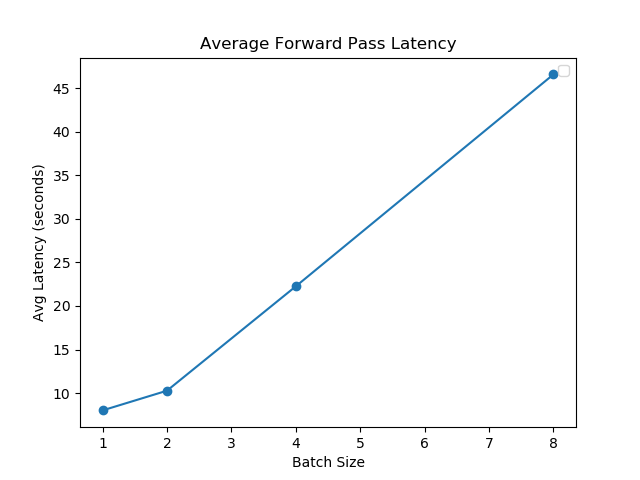
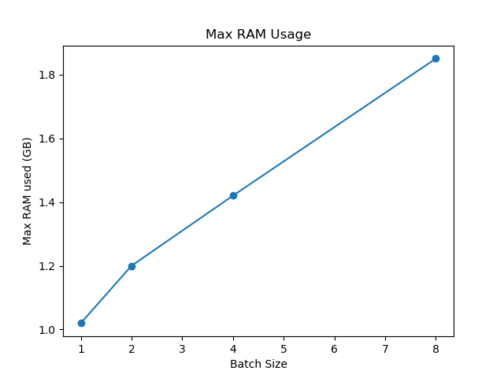

Lab 5: Group work on projects
===
The goal of this lab is for you to make progess on your project, together as a group. You'll set goals and work towards them, and report what you got done, chaellenges you faced, and subsequent plans.

Group name:
---
Group members present in lab today: Saloni Mittal, Dhruv Naik, Thomas Xu

1: Plan
----
1. What is your plan for today, and this week? 

> We had done an initial benchmark of our model in the previous lab. Now, we want to assess at what input batch sizes or other factors like memory mapped disk space do we max out the RAM on the device. Also, how does the latency and power consumption scale on doing so. 
We also want to benchmark the model's performance after quantization.

2. How will each group member contribute towards this plan?
> Each member will help transfer necessary data and model files to Jetson, and will work together to debug code errors encountered.

2: Execution
----
1. What have you achieved today / this week? Was this more than you had planned to get done? If so, what do you think worked well?
2. Was there anything you had hoped to achieve, but did not? What happened? How did you work to resolve these challenges?

| Batch Size | Avg Latency (s) | Max RAM used (GB) |
| ---   | --- | --- |
| 1 | 8.015 | 1.02
| 2 | 10.275 | 1.20 |
| 4 | 22.250 | 1.42 |
| 8 | 46.571 | 1.85 |

> Challenges:
> - We were not able to run this on the Jetson's GPU. When trying to add the "--gpu" flag, the Jetson memory usage maxed out almost immediately. We suspect that perhaps it was trying to make a copy of the model, which used up the memory. For now, we run without the "--gpu" flag.
> - The batch size used was not being set correctly from the command line argument for some reason; we had to fix this via hard coding.
> - The Jetson was out of storage space so we had to delete many other files and environments to make space for ALFRED
> - We observed memory usage increases with time for part of the execution. There was potentially a  memory leak (even after using torch.nograd() for the relevant functions). 
> - We wanted to quantize the ALFRED pretrained seq2seq model to compare performance for this lab, but ran into errors: e.g. "NoneType has no attribute 'weight'. We are still trying to debug these errors.

3. What were the contributions of each group member towards all of the above?
> - Saloni: Run different batch sizes on Jetson, debug GPU vs CPU usage, help debug quantization on Jetson, reduce input data sizes to fit on memory
> - Dhruv: Debug GPU vs CPU usage, run different batch sizes on Jetson, transfer json features to Jetson, install Jtop, clear space on Jetson
> - Thomas: Compare Jetson results to results from laptop, debug FileNotFoundErrors, record performance data, move valid_seen/valid_unseen data to Jetson, help debug quantization on Jetson

3: Next steps
----
1. Are you making sufficient progress towards completing your final project? Explain why or why not. If not, please report how you plan to change the scope and/or focus of your project accordingly.

> The team is making progress, but we have been consistently been slowed down by numerous errors and issues running the baseline models. Things that we accomplished quickly on different models in previous labs (e.g. quantization) resulted in very many bugs with the ALFRED repo that take us a long time to solve. This is an ongoing issue; if this is still the case one week from now then we plan to discuss adjusting the project scope again with the Professors.

2. Based on your work today / this week, and your answer to (1), what are your group's planned next steps?
> Next Steps:
> - Build a shallow transformer-based Seq2Seq model similar to the benchmarked model. Compare LSTM-based Seq2Seq against a transformer-based model. We hypothesise that the latency should improve with the latter as it allows data parallelism. We would also like to perform comparisons on power consumption profiles.
> - Explore other compression techniques that can be applied to our two Seq2Seq model.
> - Explore what advanced concepts/techniques introduced in the class can be utilized for our architectures. 

3. How will each group member contribute towards those steps? 
